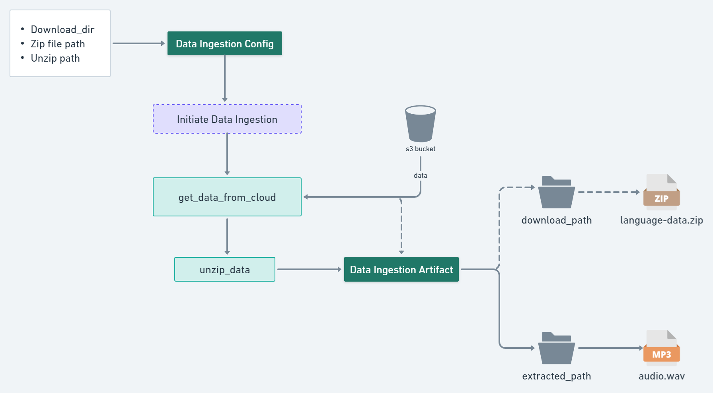
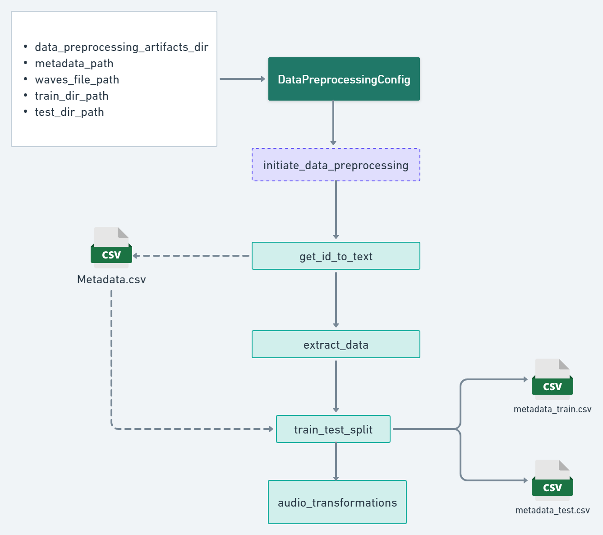
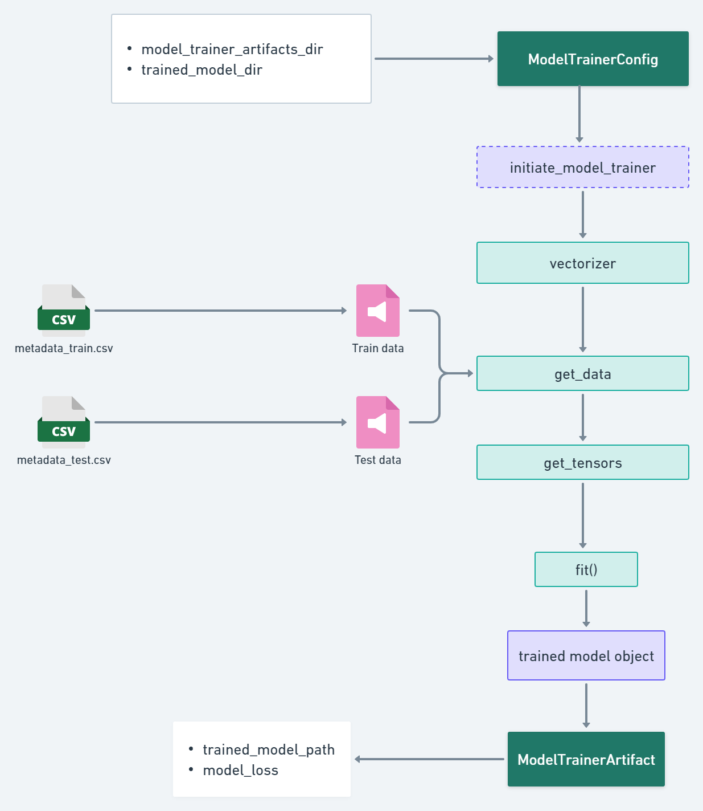
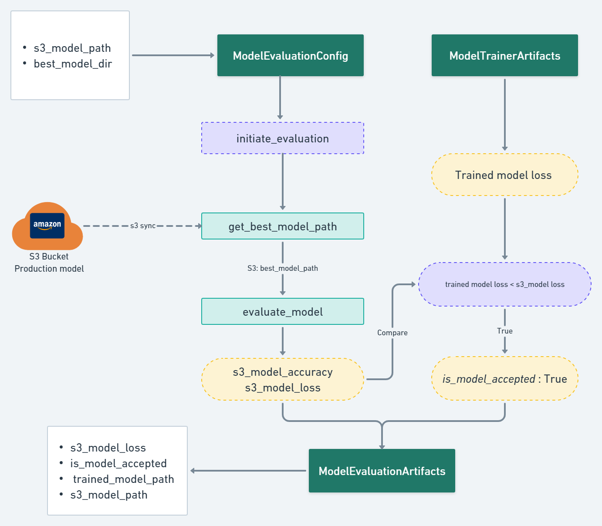
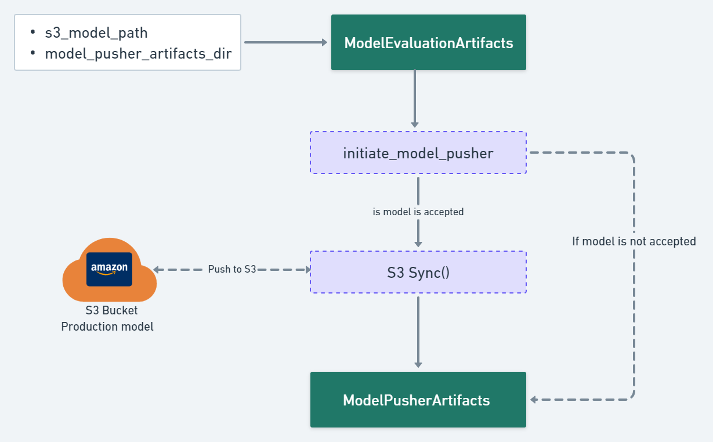

# End- End Speech to Text Conversion Project using CNN and Transformers

## Project Overview
This project presents an advanced speech-to-text conversion system leveraging state-of-the-art Deep Learning and NLP techniques, including Convolutional Neural Networks (CNN) and Transformer models. The project integrates modern data processing workflows, robust model training methodologies, and automated deployment pipelines to deliver a highly efficient and scalable solution. The entire system is containerized using Docker and deployed on AWS EC2 through a CI/CD pipeline orchestrated by GitHub Actions and Amazon ECR.

# Project Workflow

## 1. Data Ingestion

## 2. Data Preprocessing

## 3. Model Trainer

## 4. Model Evaluation

## 5. Model Pusher

## 6. Training and Prediction Pipeline
Automates the training and prediction processes.

## 7. Deployment to AWS EC2 using Docker and CI/CD pipelines
Containerizing the application using Docker, creating CI/CD pipelines with GitHub Actions, storing the Docker image on Amazon ECR and deploying the model on AWS EC2.

# Key Features:
1. Comprehensive Data Pipeline: Automates data ingestion, preprocessing, and splitting to streamline the preparation of audio datasets.
2. Advanced Model Architecture: Utilizes CNNs for feature extraction and Transformers for sequence modeling to achieve high accuracy in speech-to-text conversion.
3. Continuous Model Evaluation and Deployment: Ensures the best performing models are always deployed, leveraging AWS S3 for model storage and retrieval.
4. Scalable and Portable Deployment: Implements Docker for consistent environment setup and portability, ensuring the system can be deployed seamlessly across different environments.
5. Automated CI/CD Pipeline: Uses GitHub Actions to automate testing, building, and deployment processes, enhancing development efficiency and reliability.

# Technologies Used:

1. TensorFlow: For building and training the neural network models.
2. Docker: For containerizing the application to ensure consistency across different environments.
3. Amazon S3: For storing and retrieving model artifacts.
4. GitHub Actions: For automating CI/CD pipelines.
5. Amazon ECR: For managing Docker images.
6. AWS EC2: For deploying the application.